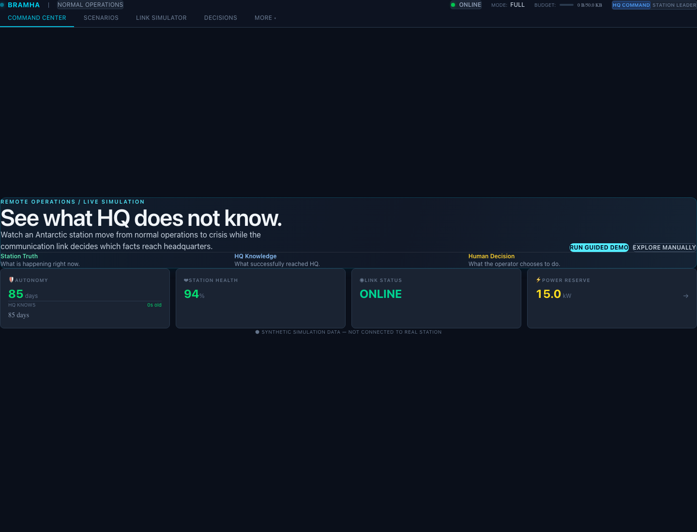
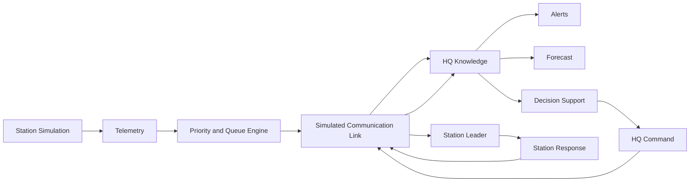
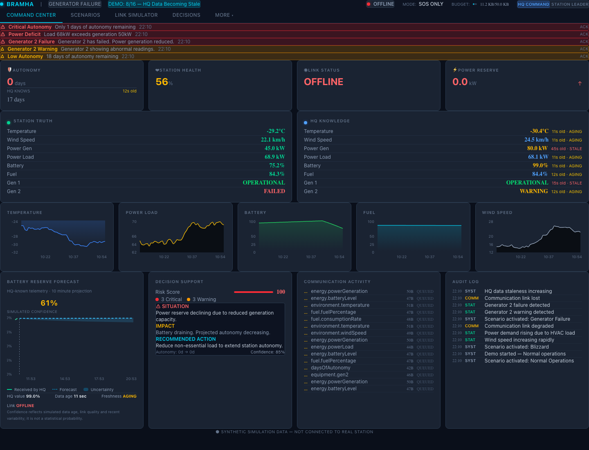
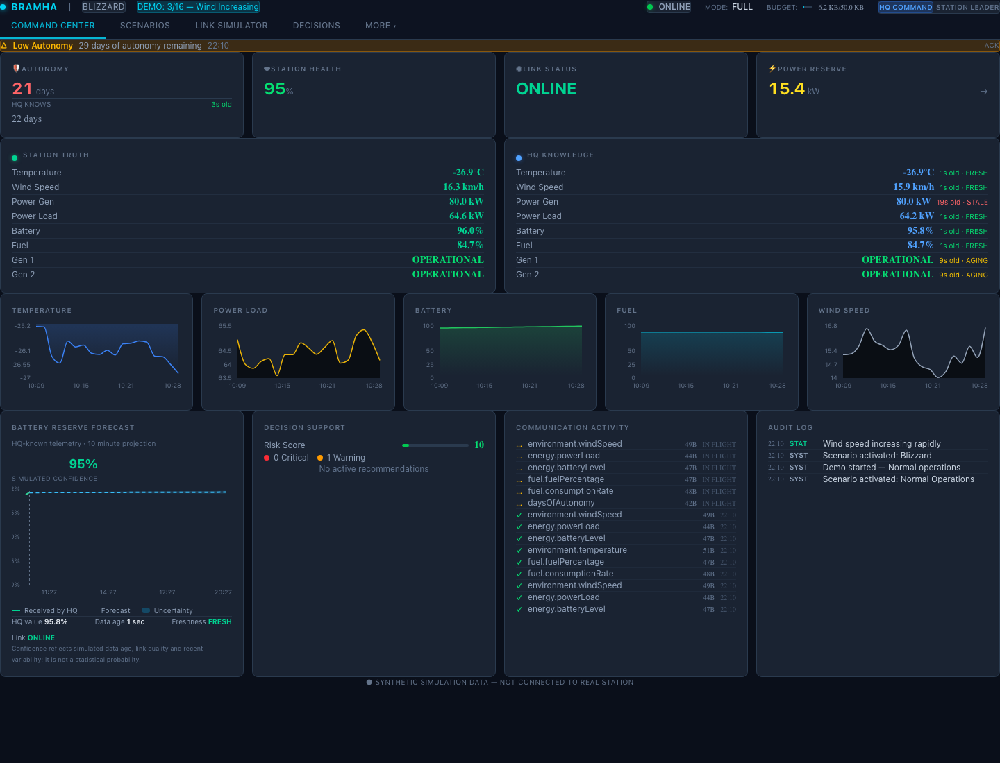
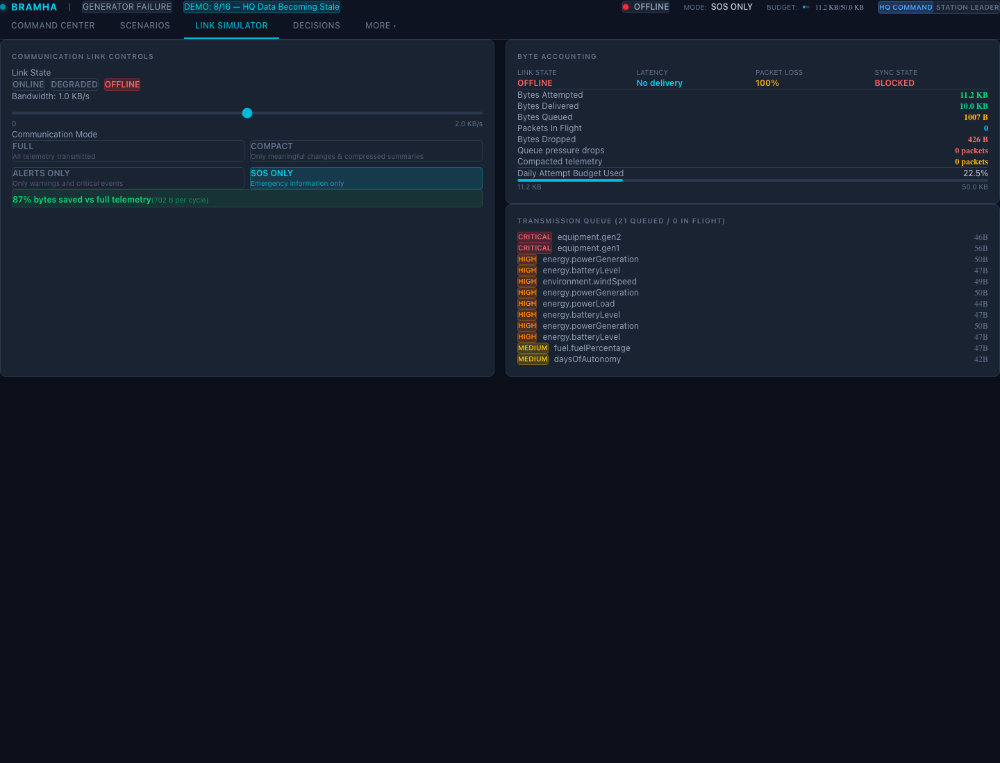
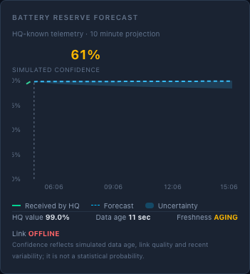
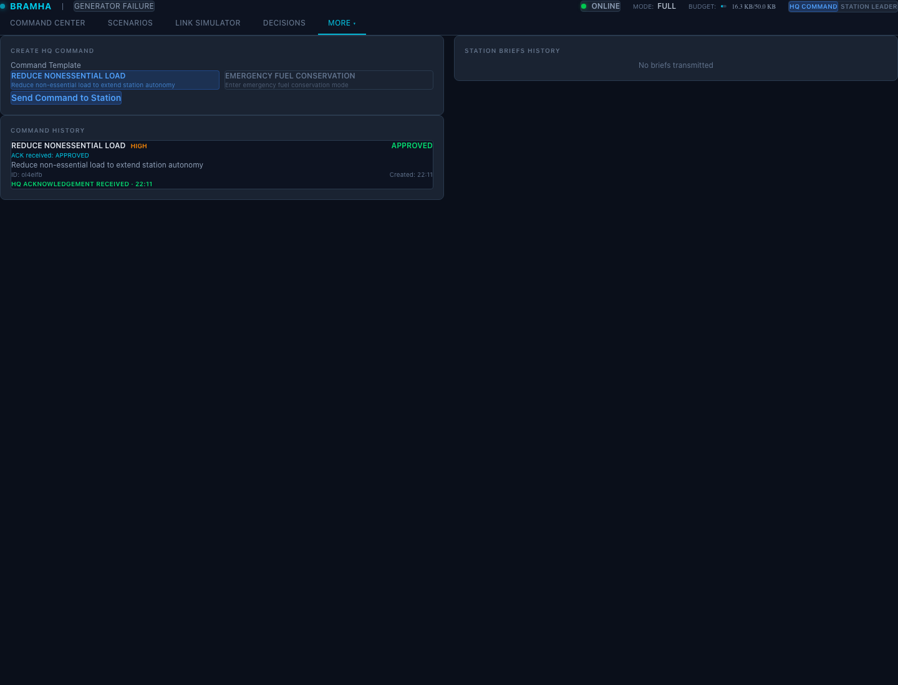

# BRAMHA

**A browser based Antarctic mission control simulator for operating through limited, delayed, degraded, or unavailable communications.**

> The station knows the truth. HQ only knows what successfully reaches it.



## The problem

Remote research stations depend on communication links that can be slow, bandwidth constrained, lossy, or unavailable. While a link is impaired, conditions at the station continue to change but headquarters may be acting on delayed or incomplete telemetry. That gap can hide worsening power, equipment, or supply conditions and increase operational risk.

## The core idea

BRAMHA makes the communication layer part of the operational picture. Station state continues to evolve independently; telemetry is prioritized and sent over a simulated link; HQ updates only when packets arrive. Operators can compare the station’s current state with HQ’s last received knowledge, assess risk, and send a command that a station leader must approve or veto.

```text
Station Conditions
        ↓
Telemetry → Prioritization → Limited Communication Link
                                      ↓
HQ Knowledge → Alerts / Forecast / Decision Support
                                      ↓
                              Human-approved Command
                                      ↓
Station Response → Acknowledgement → HQ
```

## Why this matters

The same operating pattern can apply to Antarctic research, remote mining, offshore platforms, disaster response, space missions, remote military or logistics outposts, and isolated industrial facilities. BRAMHA is a synthetic demonstration of the problem and workflow; it is not a production operations system.

## Key innovation: Station Truth vs HQ Knowledge

These are deliberately separate views. Station Truth shows the current simulated station state. HQ Knowledge shows the latest values delivered over the simulated communication link, along with their age and freshness. During a delay or outage, the difference is visible and is caused by telemetry that has not yet reached HQ.

For example, a generator can have failed at the station while HQ still holds an older warning value. The display marks those values as different and shows whether HQ’s data is fresh, aging, or stale.

## Features

- **Mission control:** command center, station health, autonomy, power reserve, alerts, and operational status.
- **Station simulation:** temperature, wind, humidity, power generation and load, battery, fuel, generator status, food and medicine supplies, and autonomy.
- **Communication resilience:** online, degraded, and offline links; simulated latency, packet loss, bandwidth constraints, priority transmission, bounded queues, and progressive synchronization.
- **HQ knowledge:** separate station and HQ values, data age, and fresh/aging/stale indicators.
- **Forecast:** deterministic trajectory and uncertainty band, with simulated confidence that responds to data age, link quality, and recent variability.
- **Alerts and decision support:** nominal, warning, and critical conditions, risk assessment, recommendations, projected autonomy, and forecast confidence.
- **Commands:** HQ command creation, delivery through the simulated link, station leader approval or veto, station response, and acknowledgement back to HQ.
- **Inventory:** food, medicine, fuel, spare parts, and requisitions.
- **Audit trail:** scenario, communication, command, approval, and station response events.
- **Guided demo:** a timed story that moves from normal operations through blizzard conditions, generator trouble, link loss, critical telemetry, command approval, and synchronization.

## Scenarios

- **Normal Operations:** stable station conditions.
- **Blizzard:** increasing environmental stress and operational demand.
- **Generator Failure:** generator degradation affects power and autonomy.
- **Communication Outage:** the station continues operating while HQ stops receiving telemetry and its view becomes stale.

Scenarios and communication conditions can be combined. For example, a generator failure can continue while the link is degraded or offline.

## Architecture



The station and communication layer are modeled in client-side simulation modules and held in Zustand stores. React renders the operator views; telemetry and commands cross the simulated link before changing the receiving side’s knowledge. There is no remote service behind the demo.

## Communication model

- **ONLINE:** normal simulated communication.
- **DEGRADED:** reduced bandwidth with simulated latency and packet loss.
- **OFFLINE:** no successful delivery; packets queue while the station continues operating.

Telemetry uses four priorities: **CRITICAL**, **HIGH**, **MEDIUM**, and **LOW**. Higher-priority information is selected first when bandwidth is constrained. Communication modes (full, compact, alerts only, and SOS only) further control what can be sent.

## Forecast model

The forecast is a lightweight deterministic simulation. It is **not** a real weather forecast, a trained machine-learning model, or a scientific Antarctic prediction system. Simulated confidence depends on HQ data freshness, recent variability, and communication state. The uncertainty band widens as HQ’s observations age.

## Screenshots

### Station truth and HQ knowledge



### Command center



### Link simulator



### Forecast and uncertainty



### Command flow



## Technology stack

- React 19 and TypeScript 6
- Vite 8
- Zustand 5
- Tailwind CSS 4
- Recharts 3
- SVG for the station schematic
- Vitest 4 for automated tests
- Oxlint for linting

## Project structure

```text
src/
├── communication/  # Link and packet delivery simulation
├── components/     # Shared command center, telemetry, forecast, and audit UI
├── pages/           # Command center and operator views
├── simulation/      # Station, scenario, and guided demo behavior
├── store/           # Zustand simulation, communication, and UI state
├── types/           # Shared simulation and communication types
└── utils/           # Forecast and formatting helpers
tests/               # Communication, command, demo, forecast, reset, and scenario tests
public/              # Static icons
docs/screenshots/    # README screenshots
```

## Installation and development

Requirements: Node.js compatible with Vite 8 and npm.

```sh
git clone <repository-url>
cd BRAMHA
npm install
npm run dev
```

The application is fully client side and requires no environment variables, API keys, or secrets.

## Production build and preview

```sh
npm run build
npm run preview
```

The production output is written to `dist/`. Vercel can use the Vite framework preset, `npm run build` as the build command, and `dist` as the output directory. The included `vercel.json` rewrites requests to the app entry point.

To deploy from Vercel’s dashboard, import the Git repository as a new project, select **Vite**, keep `npm run build` and `dist` as the build settings, leave environment variables empty, and deploy. The project also includes a `vercel.json` rewrite for the app entry point.

## Testing and linting

```sh
npm run test:run
npm run lint
```

The Vitest suite covers communication delivery and queue behavior, command round trips, guided demo lifecycle, forecast confidence, reset behavior, and scenario transitions.

## Recommended demo (2–5 minutes)

1. Start on **Command Center** and point out that Station Truth and HQ Knowledge initially agree.
2. Use **Scenarios** to trigger a blizzard, then degrade the link in **Link Simulator**.
3. Trigger **Generator Failure** and show the station state diverging from delayed HQ telemetry.
4. Set the link offline. Show HQ data aging and forecast uncertainty increasing while station simulation continues.
5. Restore the link and show queued telemetry synchronizing progressively.
6. Create a command as **HQ Command**, switch to **Station Leader**, approve or veto it, then show the station response and acknowledgement.

For the scripted story, select **Run Guided Demo** from the welcome panel. It advances through the operational and communication events and finishes with an approved load reduction and synchronization.

## Limitations

BRAMHA is a browser based synthetic simulation. It does not currently provide real station sensors, satellite communications, MQTT transport, a production backend or database, real authentication, machine-learning models, weather APIs, actual satellite packet transmission, production security, or multi-user collaboration. All station conditions and communication effects are simulated in the browser.

## Future scope

Possible future work includes real sensor integration, satellite communication, MQTT or Protobuf transport, backend persistence, validated forecasting models, GIS polar visualization, a 3D station twin, contact-window planning, local AI decision support, multi-user operations, and production security. These are not implemented capabilities.

## License

No license file is currently included. Contact the project owner before reuse or redistribution.
